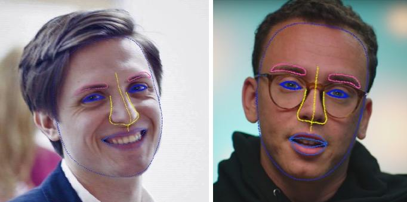
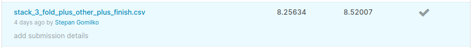

# Thousand Facial Landmarks Competition

В этом репозитории вы найдете код решения Kaggle InClass соревнования "Thousand Facial Landmarks", проходившего рамках
курса MADE Computer Vision.

Задачей соревновния было предсказать координаты 971 точек лица на основе датасета из 393 930 фотографий.

За основу проекта был взят [baseline от организаторов конкурса](https://github.com/BorisLestsov/MADE/tree/master/contest1/unsupervised-landmarks-thousand-landmarks-contest).

Описание моего решения можно почитать [тут](https://www.kaggle.com/c/made-thousand-facial-landmarks/discussion/150327).
Используя его, мне удалось занять 5 место с оценкой MSE 8.52007/8.25634 (Public/Private). 

###Как запустить
Warning: Это соревновательный код. Он писался для быстроты проверки гипотез, часто в ущерб универсальности, поэтому 
будьте готовы, иногда залезть в код и поменять некоторые параметры или пути к файлам.

Данные находятся по адресу https://cloud.mail.ru/public/qkCi/uFxpVsDSH. Скачайте и разархивируйте data.zip в корень
проекта. Файл test_points.csv нужно скачать отдельно и разместить в data/test.

- Запустите train.py для обучения модели. Можно выбрать любую модель из torchvision.models.

- Запустите predict.py, чтобы поулчить предсказания и файл для сабмита. В переменной weight_path укажите путь до весов 
обученной модели.

- Если вы хотите усреднить предсаказания нескольких моделей (рекомендую это сделать, т.к. это улучшает результат),
запустите stack_pred.py. В weight_path перечислите пути до csv-файлов.

- Для визуализации предсказаний, можно воспользоваться ноутбуком от организаторов visualize-test-predictions.ipynb.